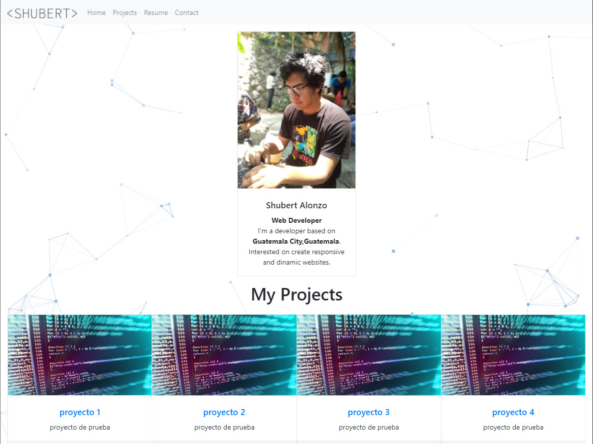

# Portfolio
## Table of contents
* [General info](#general-info)
* [Technologies](#technologies)
* [Setup](#setup)
* [Screenshots](#screenshots)

## General info
A responsive single-page website to showcase my projects.
	
## Technologies
Project is created with:
* React
* Bootstrap
* Typescript
	
## Setup
To run this project:

```
$ cd portfolio
$ npm start

Open [http://localhost:3000](http://localhost:3000) to view it in the browser.
```
## Screenshots



Posible structure:

src/
├── components/
│   ├── Navbar.vue
│   ├── HeroSection.vue
│   ├── AboutSection.vue
│   ├── ProjectsSection.vue
│   ├── ContactSection.vue
│   └── Footer.vue
├── composables/
│   └── useScrollAnimation.js
├── views/
│   └── Home.vue              # 👈 All sections live here for now
│   # Future:
│   # ├── Blog.vue
│   # └── ProjectDetail.vue
├── router/
│   └── index.js
├── App.vue
└── main.js
